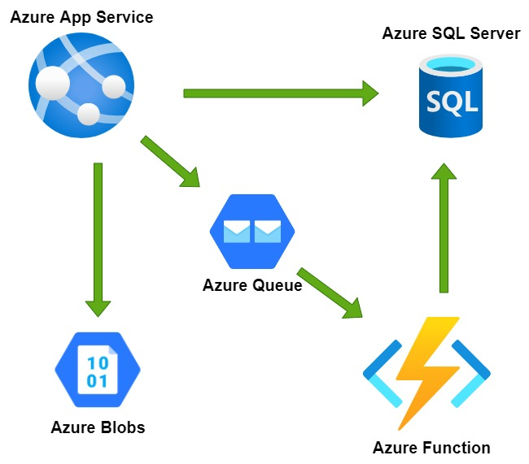
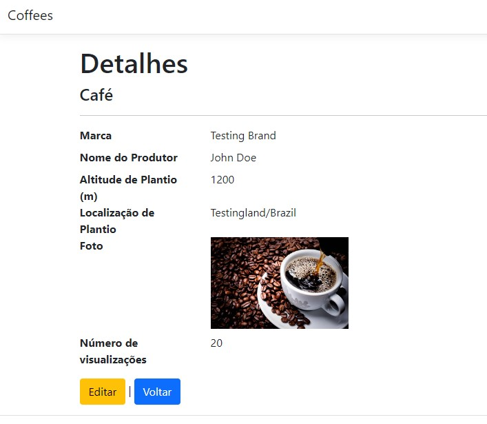

# CoffeeShop

## A coffees CRUD developed with C#, ASP.NET MVC, EntityFramework, Azure Blobs, Azure Queues, Azure functions and SQL Server.

### Requeriments:
- Visual Studio 2022;
- .NET 6;

### How the visualizations number are updated?
- You open an item details page;
- The App creates a message on a queue;
- The message triggers an Azure function;
- The function update the visualizations number at database;

